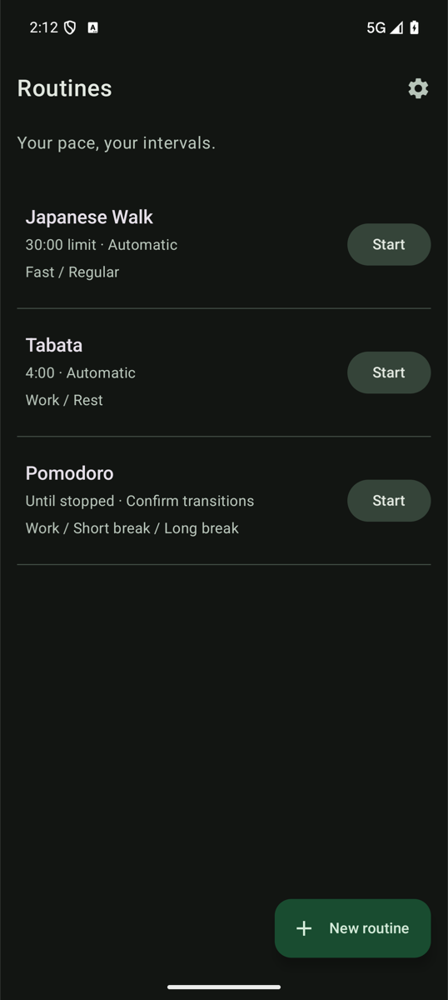
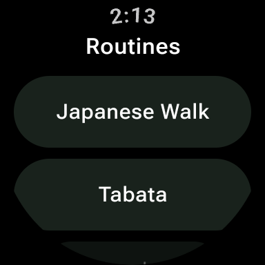

# BetterWork

[](https://github.com/powerje/BetterWork/actions/workflows/check.yml)
[](https://kotlinlang.org/)
[](https://developer.android.com/)

Like the woman said, you [better work](https://www.youtube.com/watch?v=szhf51FTYgY).

Interval timers for Android phones and Wear OS watches.

## Screenshots

<p align="center">
  
  &nbsp;&nbsp;&nbsp;
  
</p>

## Features

- [Japanese Walking](https://japaneseintervalwalking.com/blog/japanese-walking-your-complete-guide/), [Tabata](https://www.womenshealthmag.com/fitness/a34221488/what-is-tabata/), [Pomodoro](https://en.wikipedia.org/wiki/Pomodoro_Technique), and custom routines
- Named steps, repeats, time limits, and automatic or confirmed transitions
- Distinct vibration cues and optional sound
- Standalone phone and watch playback
- Phone-to-watch routine sync through the Wear OS Data Layer
- Android notification controls and home-screen widgets
- Import and export for routine libraries
- Light, dark, and system themes on Android

## Requirements

- JDK 21
- Android SDK 37
- Android SDK command-line tools

## Build

```sh
just build
```

The debug APKs are written to:

```text
phone/build/outputs/apk/debug/phone-debug.apk
wear/build/outputs/apk/debug/wear-debug.apk
```

## Test

```sh
just test       # JVM tests and walk-report tests
just lint       # Detekt and Android lint
just precommit  # Full local verification gate
```

## Project layout

| Module | Purpose |
| --- | --- |
| `shared` | Routine domain, persistence, and presentation logic |
| `platform` | Android services, cues, notifications, and device sync |
| `phone` | Android phone app and widgets |
| `wear` | Wear OS app |

